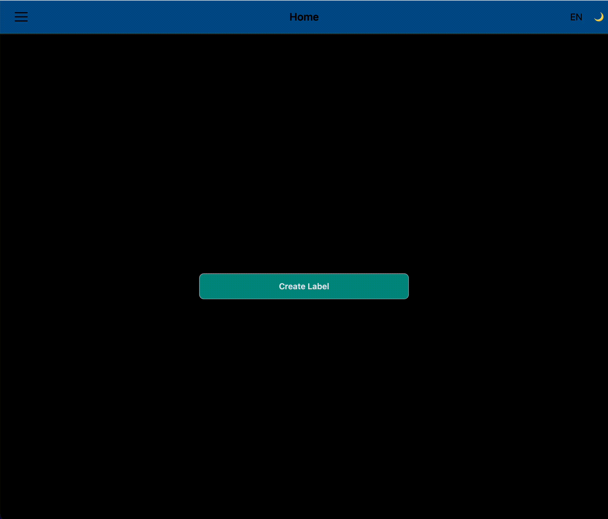

# Freedom Label

📋 A modern web application for creating and printing custom eyewear prescription labels with a mobile-first design approach.

Here is a Demo where you can try it out: https://nicobees.github.io/freedom-label

> Have a look at the AI-based auto-fill form feature 😎
>
> ⚠️ This requires Chrome version 140+ and the following flags to be "Enabled"
>
> chrome://flags/#prompt-api-for-gemini-nano
>
> chrome://flags/#prompt-api-for-gemini-nano-multimodal-input

## 📝 Project Description

Freedom Label © is a comprehensive solution for eyewear prescription label management, built as a modern web application with React frontend and FastAPI backend. The application provides an intuitive interface for creating detailed prescription labels including patient information, lens specifications, and manufacturing details.

**Key Features:**

- 🏥 Patient information management (name, surname)
- 👁️ Comprehensive lens specifications (BC, DIA, PWR, CYL, AX, ADD, SAG)
- 📅 Manufacturing date tracking
- 🖨️ Direct label printing via CUPS integration
- 🌓 Light/dark theme support
- 📱 Mobile-first responsive design (to be fixed)
- 💾 Local storage for printed labels history
- ♿ Accessibility-focused design with ARIA support
- 🌍 Internationalization ready
- 🔄 Undo/redo history in the lens form
- !!! AI !!! Auto-fill lens form using natural language prompts, with both text and voice input (uses Chrome built-in Gemini nano model)

## 🏗️ Architecture

This is a monorepo containing three main packages:

### 📦 Packages Structure

```
packages/
├── frontend/          # React + TypeScript SPA
├── backend/           # FastAPI Python application
└── devops/           # Docker compose & deployment configs
```

### Frontend Application (`packages/frontend`)

Please check the [frontend README](packages/frontend/README.md) for detailed instructions.

- **Technology Stack:** React 19, TypeScript, Vite, TanStack Router, TanStack Form
- **Styling:** Pure CSS with CSS custom properties, mobile-first approach
- **Testing:** Vitest, Testing Library, jsdom
- **Key Features:**
  - Responsive design with breakpoint-aware layouts
  - Theme system with CSS layers and custom properties
  - Form validation using Zod schemas
  - Local persistence for printed labels
  - Accessible component library

### Backend Application (`packages/backend`)

Please check the [backend README](packages/backend/README.md) for detailed instructions.

- **Technology Stack:** FastAPI, Python, Poetry
- **Key Features:**
  - RESTful API for label creation and printing
  - CUPS printer integration
  - PDF generation for label output
  - Dockerized deployment

### DevOps (`packages/devops`)

Please check the [devops README](packages/devops/README.md) for detailed instructions.

- **Deployment Target:** Raspberry Pi (or any Linux server)
- **Container Orchestration:** Docker Compose
- **CI/CD:** GitHub Actions with automated builds and deployments
- **Monitoring:** System service integration with auto-restart capabilities

## ⚡ Quick Start

### Prerequisites

- Node.js 18+ and npm
- Python 3.11+ and Poetry
- Docker and Docker Compose

### Local Development

1. **Clone the repository:**

   ```bash
   git clone https://github.com/nicobees/freedom-label.git
   cd freedom-label
   ```

2. **Start the backend:**

   ```bash
   cd packages/backend
   poetry install
   poetry run uvicorn app.main:app --host 0.0.0.0 --port 8000 --reload
   ```

3. **Start the frontend:**

   ```bash
   cd packages/frontend
   npm install
   npm run dev
   ```

4. **Access the application:**
   - Frontend: http://localhost:5173
   - Backend API: http://localhost:8000
   - API Documentation: http://localhost:8000/docs

### Docker Development

Run both services using Docker Compose:

```bash
cd packages/devops
docker-compose up -d
```

## 📸 Usage Examples

### Creating a Label

1. **Navigate to Create Label:** Click "Create Label" from the homepage
2. **Fill Patient Information:** Enter patient name and surname
3. **Configure Lens Specifications:**
   - Enable left/right eye as needed
   - Set values for BC, DIA, PWR, CYL, AX, ADD, SAG
   - Use copy actions to mirror values between eyes
4. **Set Manufacturing Details:** Add description and date
5. **Print:** Click the print button to generate and print the label



### Theme Switching

Toggle between light and dark themes using the ☀️/🌙 button in the header.

### Form Navigation

The application includes:

- Dirty state detection for unsaved changes
- Undo/redo functionality for form edits
- Auto-save to local storage for recovery

## 🛠️ Configuration

### DevOps Configuration

Please check the [devops README](packages/devops/README.md) for detailed instructions.

Set up deployment variables in `packages/devops/.env`:

```bash
# Docker image versions
BACKEND_VERSION=b-0.0.4
FRONTEND_VERSION=f-0.0.6

# Container registry
GITHUB_USERNAME=your-username
GITHUB_REPOSITORY_NAME=freedom-label
GITHUB_IMAGE_BACKEND=freedom-label-backend
GITHUB_IMAGE_FRONTEND=freedom-label-frontend

# Deployment target
RPI_HOST=your-raspberry-pi-ip
RPI_USERNAME=your-username
```

## 🚀 Deployment

### Production Deployment (Raspberry Pi)

Please check the [Raspberry Pi Configuration](packages/devops/raspberry-pi-config.md) for detailed instructions.

1. **Prepare the Raspberry Pi:**

   ```bash
   # Install Docker
   curl -fsSL https://get.docker.com -o get-docker.sh
   sudo sh get-docker.sh

   # Enable user lingering for auto-start
   sudo loginctl enable-linger $USER
   ```

2. **Clone and configure:**

   ```bash
   git clone https://github.com/nicobees/freedom-label.git
   cd freedom-label/packages/devops
   cp .env.example .env
   # Edit .env with your configuration
   ```

3. **Set up systemd service:**

   ```bash
   sudo cp freedom-label.service /etc/systemd/system/
   sudo systemctl daemon-reload
   sudo systemctl enable freedom-label.service
   sudo systemctl start freedom-label.service
   ```

4. **Deploy using CI/CD:**
   - Push to the main branch triggers automatic deployment
   - Or manually run deployment scripts in `packages/devops/scripts/`

### Manual Deployment

Use the provided scripts for manual updates:

```bash
cd packages/devops/scripts
./pull-images.sh --b "0.0.4" --f "0.0.6"
./deploy.sh --b "0.0.4" --f "0.0.6"
```

## 🧪 Testing

### Frontend Testing

```bash
cd packages/frontend
npm test                    # Run all tests
npm run test:coverage       # Run with coverage report
npm run test:ui            # Interactive test UI
```

### Backend Testing

```bash
cd packages/backend
poetry run pytest          # Run all tests
poetry run pytest --cov    # Run with coverage
```

## 🔧 Development Guidelines

### Code Style

- **Frontend:** ESLint + Prettier with TypeScript strict mode
- **Backend:** Black + isort + mypy for Python
- **CSS:** Pure CSS with BEM-inspired naming, mobile-first approach
- **Testing:** Comprehensive unit tests with Testing Library patterns

### Architecture Principles

- **Mobile-first responsive design**
- **Accessibility as a core requirement**
- **Progressive enhancement**
- **Clean separation of concerns**
- **Comprehensive error handling**

## 📄 License

This project is licensed under the Apache License 2.0 - see the [LICENSE](LICENSE) file for details.

## 🚀 Roadmap

- [ ] List view of printed labels with search/filter
- [ ] Undo/redo feature in form editing
- [ ] Firebase backend for cloud storage and sync
- [ ] Fully automated release process (using GitHub Actions and Raspberry Pi Connect service)
